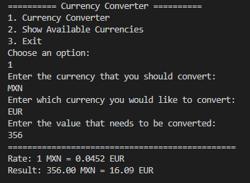

# 💱 Conversor de Moneda - Proyecto Java con API

Este proyecto es un **Conversor de Moneda** desarrollado en Java como parte del curso de Alura, utilizando la **ExchangeRate API** para obtener tasas de cambio en tiempo real.

La aplicación permite convertir montos entre monedas populares y consultar los tipos de cambio disponibles, todo desde una interfaz de consola amigable.

---

## 🚀 Funcionalidades

- ✅ Conversión entre monedas en tiempo real
- ✅ Menú interactivo por consola
- ✅ Validación de códigos de moneda desde la API
- ✅ Filtrado de monedas populares: ARS, BOB, BRL, CLP, COP, EUR, MXN, USD
- ✅ Manejo de errores de red y de respuesta

---

## 🧱 Tecnologías utilizadas

- [Java 21](https://www.oracle.com/java/technologies/javase-downloads.html)
- [Maven](https://maven.apache.org/)
- [Gson](https://github.com/google/gson) – para parsear JSON
- [ExchangeRate API](https://www.exchangerate-api.com/) – proveedor de datos de conversión

---

## ❓ ¿Cómo ejecutar el proyecto?
1. Clona el repositorio o descarga el proyecto
- git clone https://github.com/tuusuario/ConversorMoneda.git
- cd ConversorMoneda

2. Asegurate de tener Java y Maven instalados
- java -version
- mvn -version

3. Reemplaza tu clave API en el archivo **ConversorApp.java**
- private static final String API_KEY = "Tu_Clave_API";

4. Ejecuta el proyecto desde la terminal
- mvn spring-boot:run

---

## 🖼️ Ejemplo de uso por consola

---

## ❓ ¿Cómo obtener tu clave API?
- Debes obtener una clave gratuita en:
- https://www.exchangerate-api.com
- Solo necesitas registrarte y copiar la clave que te asignen

---

## 🧠 Aprendizajes del proyecto

- Cómo estructurar un proyecto Java real con Maven

- Uso de clases modernas como HttpClient, HttpRequest y HttpResponse

- Manejo de errores y validaciones de entrada por consola

- Procesamiento de JSON en tiempo real con Gson

- Consumo de servicios REST externos

---

## 🎓 Proyecto de portafolio

- Este proyecto forma parte de mi portafolio como desarrollador Java Backend. Fue desarrollado con fines educativos dentro del programa de formación
- de **Alura LATAM**, y lo uso como ejemplo de integración de APIs externas en Java.

---

## 📄 Licencia

- Este proyecto es de uso libre con fines educativos y/o personales.
- El uso comercial de los datos de la API requerirá una licencia premium de ExchangeRate API.